<h1 align="center">
📄 Projeto Módulo Integrador de Sistemas Digitais - Problema 02.
</h1>

<h4 align="center">
Projeto produzido a ser avaliado pela disciplina de M.I Sistemas Digitais da Universidade Estadual de Feira de Santana.
</h4> 

<h2 align="center">
🖥️ Implementação de uma interface homem-máquina através de um display LCD utilizando a plataforma de desenvolvimento Orange Pi.
</h2>

<h1 id="sumario" align="center">Sumário</h1>
</h2>
<ul>
  <li><a href="#membros"><b>Equipe de Desenvolvimento</b></li>
  <li><a href="#introducao"> <b>Introdução</b></li>
  <li><a href="#requisitos"> <b>Objetivos e Requisitos do problema</b> </a></li>
  <li><a href="#recursos"> <b>Recursos Utilizados</b></li>
  <li><a href="#desenvolvimento"> <b>Desenvolvimento e Descrição em Alto Nível</b> </a> </li>
  <li><a href="#descricao-e-analise-dos-testes"> <b>Descrição e Análise dos Testes e Simulações, Resultados e Discussões</b> </a></li>
  <li><a href="#conclusao"> <b>Conclusão</b> </a></li>
  <li><a href="#bibliografia"> <b>Bibliografia</b> </a></li>
  <li><a href="#script-de-compilacao"> <b>Uso do projeto</b> </a></li>
</ul>

<h1 id="membros" align="center">Equipe de Desenvolvimento</h1>

  <ul>
		<li><a href="https://github.com/douglasojesus"> Douglas Oliveira de Jesus </li>
		<li><a href="https://github.com/Emanuel-Antonio"> Emanuel Antonio Lima Pereira </a></li>
      <li><a href="https://github.com/emersonrlp"> Emerson Rodrigo Lima Pereira </a></li>
      <li><a href="https://github.com/GabrielSousaSampaio"> Gabriel Sousa Sampaio </a></li>
  </ul>

<h1 id="introducao" align="center">Introdução</h1> 

 
Uma interface homem-máquina, muitas vezes abreviada como IHM, é um ponto de interação entre seres humanos e máquinas. Essa interface pode assumir várias formas, desde simples botões e telas sensíveis ao toque até interfaces mais avançadas, como realidade virtual ou assistentes de voz. Sua implementação permite que os usuários interajam, controlem e recebam informações de um dispositivo ou sistema, tornando-se crucial para essa interação. Dessa forma, ela determina o modo como as pessoas se comunicam e controlam tecnologias, afetando a usabilidade, acessibilidade e experiência do usuário. 
    
Nesse cenário, o projeto a seguir descreve a criação de uma Interface Homem-Máquina para um display LCD de um sistema de sensoriamento de temperatura e umidade mantendo sua funcionalidade e apresentação de dados, agora programada em Assembly, assim substituindo a interface anterior via comandos pelo terminal e desenvolvida em linguagem C. Assim, o foco principal é atender aos requisitos de programação em Assembly e aplicar os conceitos fundamentais de arquitetura de computadores para um Sistema de Placa Única (SBC), especificamente o Orange Pi PC PLUS.
 

<h1 id="requisitos" align="center">Objetivos e Requisitos do problema</h1> 

O desenvolvimento deste projeto propõe a criação de uma camada de abstração para o hardware através de uma interface para o usuário utilizando um Single Board Computer (SBC) Orange Pi PC PLUS, linguagem Assembly e um Display LCD HD44780. Este projeto é uma extensão do Problema 01, onde implementamos a comunicação serial com o sensor DHT11 usando UART e interagimos com o computador através do terminal de comando. 

Portanto, o principal propósito desse trabalho é capacitar o discente a programar em Assembly para o processador ARM, compreender e aplicar o conjunto de instruções específicas da arquitetura, manipular e mapear a memória do dispositivo, além de avaliar o desempenho do código resultante por meio de medidas que refletem o comportamento da execução no sistema. Para isso, necessita-se cumprir dois requisitos básicos:

- 📝O código deve ser escrito em Assembly;
- 📝 O sistema só poderá utilizar os componentes disponíveis no protótipo;

<h1 id="recursos" align="center">Recursos utilizados</h1> 

- 🔧 Visual Studio Code;
- 🔧 Git e Github;
- 🔧 SBC Orange Pi PC PLUS;
- 🔧 Linguagem Assembly;
- 🔧 Display LCD HD44780;
- 🔧 Sensor DHT11;

<h2>SBC Orange Pi PC PLUS</h2>

A Orange Pi PC Plus é uma Single-Board Computer (SBC), projetada para oferecer funcionalidade semelhante a um computador em um formato compacto e de baixo custo. Ela é frequentemente utilizada em projetos de prototipagem, automação residencial, servidores de mídia, sistemas de vigilância, entre outros, devido à sua versatilidade, tamanho compacto e custo acessível, além de suporte a diferentes sistemas operacionais e recursos de conectividade. Dentre suas principais especificações, têm-se:

<h3>Hardware acoplado</h3>

- Processador: Utiliza um SoC (System-on-Chip) Allwinner H3 Quad-core Cortex-A7 com frequência de até 1,6 GHz.
  
- GPU: Mali-400 MP2 @600MHz, oferecendo suporte para gráficos e vídeo.
  
- Memória RAM: 1 GB de memória DDR3.
  
- Armazenamento: Suporta cartões microSD para armazenamento externo e possui um slot para cartão eMMC.
  
- Conectividade: Ethernet 10/100M, WiFi 802.11 b/g/n, Bluetooth 4.0.
  
- Portas: Inclui 3 portas USB 2.0, uma porta OTG USB 2.0, HDMI para conexão de vídeo, conector de áudio de 3,5 mm, GPIO (General Purpose Input/Output) para interconexão com outros dispositivos.
  
- Slots: Um slot para cartão microSD e um conector de 40 pinos para expansão e conexão de periféricos.
  
- Sistema Operacional: Suporta uma variedade de sistemas operacionais baseados em Linux, como Ubuntu, Debian Image e Android 4.4.

<h3>Recursos Adicionais:</h3>

- GPIO e Conectividade: Possui recursos de GPIO que permitem interações com sensores e dispositivos externos, ampliando suas possibilidades de uso em projetos de IoT (Internet das Coisas) e automação.
  
- Suporte a Vídeo: Capaz de reproduzir vídeos em alta definição (HD) e suporta formatos de vídeo populares.

<h2>Assembly Linguagem</h2>

A linguagem Assembly, ou linguagem de montagem, é uma linguagem de baixo nível que se encontra muito próxima da linguagem de máquina, representando instruções diretamente compreensíveis pelo processador. Ela é específica para a arquitetura do processador em questão e consiste em um conjunto de códigos mnemônicos que representam operações básicas executadas pela CPU. A linguagem Assembly permite um controle direto sobre o hardware do sistema. Cada instrução corresponde a uma operação específica no nível do processador, como movimentação de dados, operações aritméticas, controle de fluxo, entre outras.

A sua aplicação é principalmente produtiva em situações onde é necessário um controle preciso sobre o hardware para otimização de código, como em sistemas embarcados, drivers de dispositivos e algumas partes críticas de softwares que exigem desempenho máximo. Em sistemas embarcados, onde a eficiência de recursos é crucial, a linguagem Assembly é empregada para programar microcontroladores e SBCs (Single-Board Computers) devido ao maior controle e gerenciamento de recursos sobre o hardware.

<h2>Tela LCD HD44780</h2>

O display LCD HD44780 é um display de caracteres amplamente utilizado em projetos eletrônicos e sistemas embarcados devido à sua facilidade de uso e versatilidade. Ele oferece uma interface capaz de exibir texto alfanumérico, caracteres especiais e símbolos predefinidos. Vale ressaltar que cada caractere é formado por uma matriz de pixels. 

O display utiliza tecnologia de cristal líquido (LCD - Liquid Crystal Display) para exibir informações e consiste em uma matriz de caracteres organizados em linhas e colunas, nesse caso 16x2( duas linhas e 16 colunas).

O HD44780 é um controlador de display integrado que simplifica a interface entre o display e o microcontrolador, facilitando a comunicação. Ele normalmente opera com uma interface paralela, o que significa que requer várias linhas de dados para transmitir informações. Essas linhas são usadas para enviar comandos e dados ao display, como caracteres para serem exibidos, instruções de controle, entre outros.

<h1 id="desenvolvimento" align="center">Desenvolvimento e Descrição em Alto Nível</h1>

<h2>DESCRIÇÃO E PRÉ-ELABORAÇÃO DO MENU INTERATIVO EM ALTO NÍVEL</h2>

A primeira etapa para a criação desse sistema foi a projeção do seu funcionamento em alto nível. Dessa forma, decidiu-se que o menu interativo que será exibido no display LCD possui três camadas principais. Essas camadas representam as opções de interação que o usuário possui com o sistema. A navegação entre essas camadas ocorre através da interação do usuário com botões acoplados ao sistema.

<h3>Fluxo de navegação da interface:</h3>

<h4>Camada 1 - Escolha da Funcionalidade</h4>

O usuário inicialmente é apresentado com opções de funcionalidades do sistema. O sistema, em si, possui cinco funcionalidades: 

- Situação Atual do Sensor;
  
- Temperatura Atual;
  
- Umidade Atual;
  
- Monitoramento Contínuo de Temperatura;
  
- Monitoramento Contínuo de Umidade. 

Essas funcionalidades serão exibidas, individualmente, em formato de texto na primeira linha do LCD. Dessa forma, o usuário utiliza os botões laterais para avançar ou retroceder entre as cinco opções, sendo a tela inicial a “situação atual do sensor”. O botão do meio é usado para selecionar uma das funcionalidades apresentadas, avançando para a segunda camada.

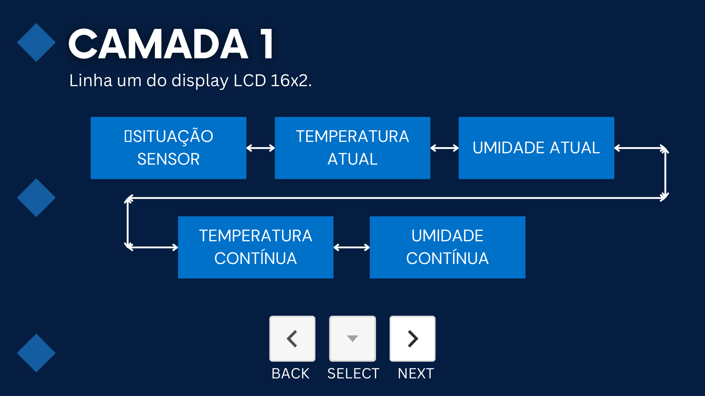

<h4>Camada 2 - Escolha do Sensor</h4>   

Após selecionar uma funcionalidade na primeira camada, o usuário é direcionado para a próxima camada, onde pode escolher um dos 32 sensores disponíveis para aplicar a funcionalidade selecionada anteriormente. O número do sensor aparecerá na segunda linha do display e, assim como na camada anterior,  os botões da esquerda e da direita serão utilizados para percorrer a lista de sensores. Ao apertar o botão do meio, o usuário escolhe o sensor e avança para a terceira camada.

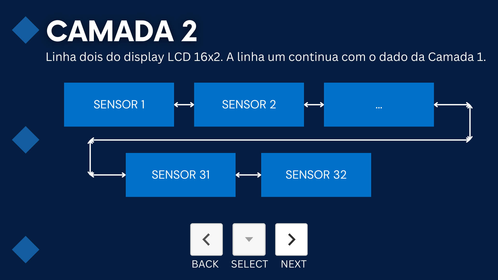

<h4>Camada 3 - Exibição do Resultado</h4>

Na terceira camada, após escolher um sensor, o resultado da funcionalidade de temperatura e umidade selecionada é exibido na linha inferior do display, enquanto os resultados textuais (sobre o funcionamento ou não do sensor e os erros apresentados) são apresentados na linha superior do display. Essa camada apresenta os dados ou informações correspondentes à funcionalidade e ao sensor selecionados, podendo ser:
 

- Sensor funcionando;
  
- Sensor com problema;
  
- Sensor inexistente;
  
- Valor X da temperatura (atual ou continua) em graus celsius (°C);
  
- Valor Y da umidade (atual ou contínua) em %.

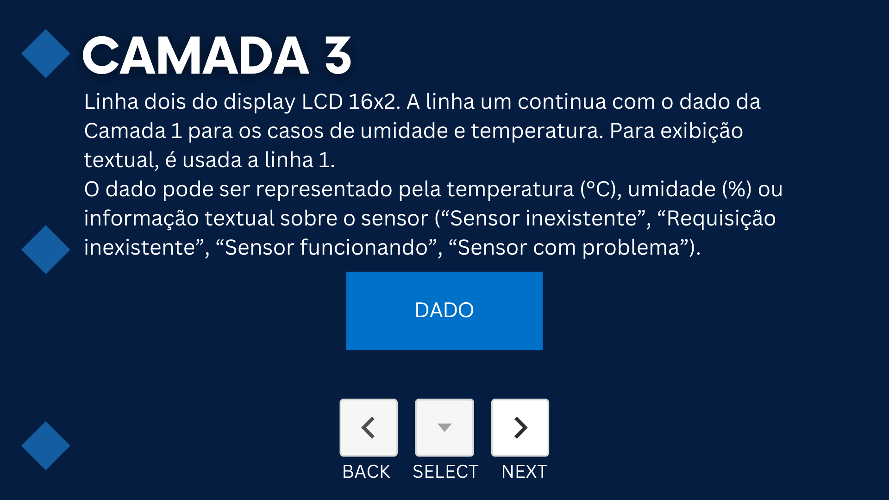
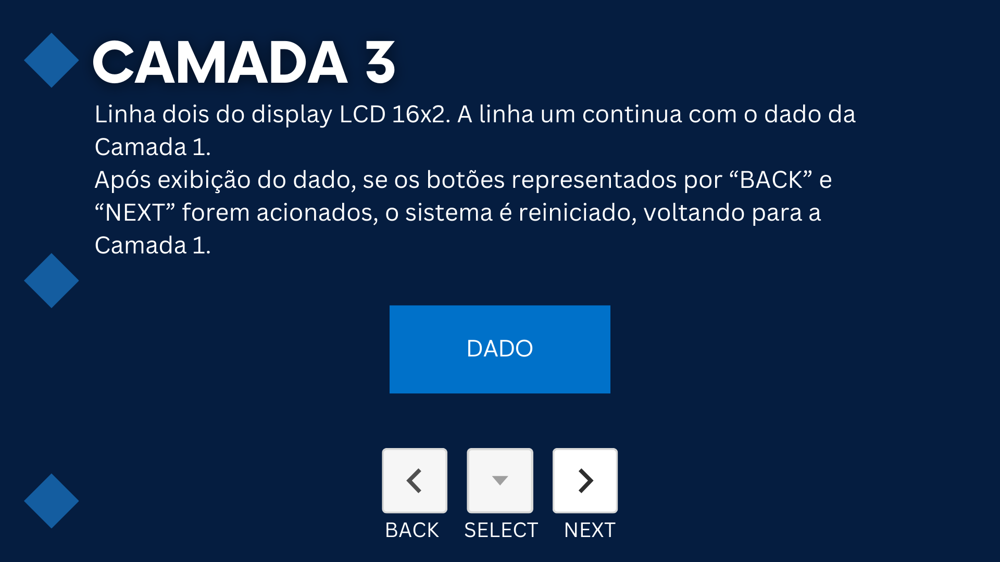

<h2>FLUXO DE EXECUÇÃO DO SISTEMA</h2>

A execução geral desse sistema envolve uma série de etapas essenciais para o seu funcionamento. Sendo elas:

- Mapeamento da memória das interfaces de entrada e saída (IOUT): 
O primeiro passo consiste em mapear a memória das IOUT da Orange Pi PC PLUS. Através do mapeamento dos pinos é possível acessar os demais dispositivos, tais como: display, sensor, botões, etc. e acoplá-los na placa.

- Configuração dos pinos (entrada, saída, alto ou baixo): 
Após o mapeamento da memória das IOUT, é essencial configurar os pinos da Orange Pi para atuarem como entradas ou saídas, dependendo das necessidades do sistema. Isso pode ser alcançado através da manipulação de registradores específicos ou instruções de configuração de pinos presentes no manual da placa.

- Inicialização do display LCD: 
Para habilitar o display LCD,necessita-se de um procedimento de inicialização que envolve a identificação do controlador do display, configuração dos parâmetros de comunicação e inicialização dos registros necessários para o correto funcionamento dos pinos atrelados ao display.

- Exibição do menu do sistema no display por de rotinas no código: 
A exibição do sistema no display LCD é realizada por meio de rotinas específicas desenvolvidas para controlar e manipular o conteúdo a ser exibido. Isso ocorre através do código, onde o estado em que o sistema se encontra e as ações realizadas por ele, são praticamente pré-definidas.

- Mapeamento e configuração da UART: 
A comunicação serial UART é um aspecto vital para a interação com o sistema. Isso requer o mapeamento dos registradores de comunicação UART na Orange Pi PC PLUS e a configuração de velocidade de comunicação, formato de dados e outros parâmetros para garantir uma comunicação estável e confiável. Esse mapeamento e configuração da UART são feitos através de subrotinas no código. 

O fluxograma abaixo ilustra a organização desse conjunto de procedimentos.

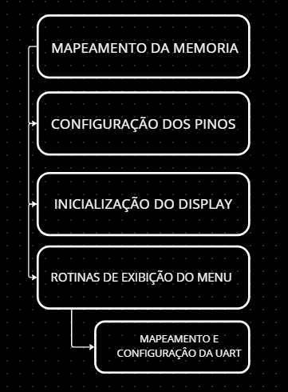

Todas etapas serão discutidas nas subseções abaixo referente ao desenvolvimento do projeto.

<h2>MAPEAMENTO GPIO</h2>

Antes de explicar as macros e funções da GPIO, faz-se necessário entender como ocorre o mapeamento de memória e a configuração dos pinos para os dispositivos utilizados no sistema. No contexto da Orange Pi, o controle dos pinos GPIO (General Purpose Input/Output) é feito por meio de registradores específicos que ficam localizados em uma parte da memória do próprio dispositivo. Ao verificar o datasheet da Allwinner referente ao processador quad-core H3, adquirimos o endereço base desse “banco” de registradores.Uma vez que se tem acesso ao endereço base, pode-se utilizar deslocamentos (off-sets) para acessar e manipular os registradores desejados.

Os registradores são compostos, em geral, de 32 bits. No caso dos registros usados para a configuração dos pinos como entrada e saída, possui-se uma subdivisão onde cada conjunto de 3 bits representa um pino GPIO. Dessa forma, os 3 bits específicos dentro desses conjuntos são usados para configurar se o pino será usado como entrada, saída, desabilitado, e outras opções, conforme necessário para o projeto.

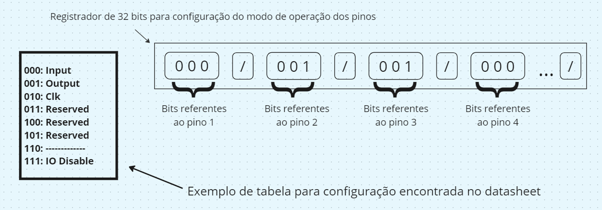

Os registros referentes ao controle de estado da GPIO  funcionam de maneira diferente. Os bits dos registradores de controle de estado são manipulados para definir o estado de cada pino individualmente, podendo ser configurados como alto (1) ou baixo (0) conforme a necessidade do projeto. Ou seja, cada pino está atrelado a um bit do registrador.

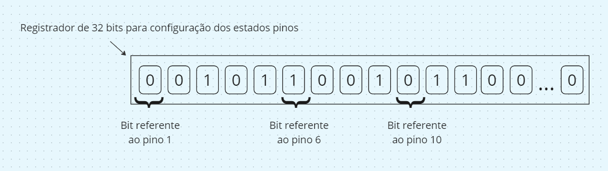

Uma vez que se esclarece o mapeamento dos pinos GPIO, pode-se explicar a funcionalidade de cada macro e função utilizadas no projeto.
 
- MapeamentoMemoria:
  Realiza a abertura do arquivo correspondente aos GPIOs usando a chamada de sistema sys_open.
Mapeia a memória física dos GPIOs no espaço de endereçamento virtual do processo usando a chamada de sistema sys_mmap2.

- GPIOPinEntrada:
  Configura um pino GPIO para modo de entrada.
Isso é feito manipulando os registradores associados ao pino.

- GPIOPinSaida:
  Configura um pino GPIO para modo de saída.
Semelhante ao GPIOPinEntrada, manipula os registradores associados ao pino.

- GPIOPinAlto:
  Define o estado de um pino GPIO como alto (1).

- GPIOPinBaixo:
  Define o estado de um pino GPIO como baixo (0).

- getBitEstado:
  Lê o estado atual de um pino GPIO (alto ou baixo) e armazena o resultado em um registrador.

- GPIOPinTurn:
  Altera o estado de um pino GPIO para alto (1) ou baixo (0) com base em um valor passado como parâmetro, através de outras labels denominadas de pinHigh (para alto) e pinLow (para baixo).

Os registros referentes ao controle de estado da GPIO  funcionam de maneira diferente. Os bits dos registradores de controle de estado são manipulados para definir o estado de cada pino individualmente, podendo ser configurados como alto (1) ou baixo (0) conforme a necessidade do projeto. Ou seja, cada pino está atrelado a um bit do registrador.

Uma vez que se esclarece o mapeamento dos pinos GPIO, pode-se explicar a funcionalidade de cada macro e função utilizadas no projeto.

<h2>CCU (unidade de controle de relógio)</h2>

A maioria dos dispositivos, incluindo a CPU, são concebidos como máquinas de estado, onde a transição de estados é impulsionada pelo sinal de relógio. Em alguns casos, um único sinal de relógio pode ser suficiente, mas em sistemas mais complexos, como a Orange Pi PC Plus e outros sistemas embarcados, a Unidade de Controle de Relógio (CCU) desempenha um papel crucial. Ela permite a gestão de sinais de relógio distintos para garantir o funcionamento adequado de diferentes componentes. Esses sistemas embarcados são equipados com hardware especializado, como a CCU, que facilita a administração dos sinais de relógio enviados a outros dispositivos. A configuração da taxa de transmissão pode ser realizada através da CPU, permitindo a modificação de dados em registradores específicos por meio do barramento do sistema, seguindo princípios semelhantes aos aplicados em outros dispositivos como a Raspberry Pi.

Falando mais especificamente sobre a implementação em Assembly:

- mapeamentomemoriaccu:
  Macro desenvolvida para mapear uma região específica da memória, muito semelhante ao mapeamento de memória do GPIO. Essa região possui o mesmo endereço base (0x1C20), porém, ao contrário do mapeamento de GPIO, não requer um deslocamento ao final da macro.

- configuracaoccu:
  A macro feita para configurar a CCU, executa as seguintes tarefas em sequência, são elas:
	- Habilita a saída do PLL_ENABLE por meio do registro PLL_PERIPH0_CTRL_REG;
	- Ativa um clock específico do APB2_CLK_SRC_SEL através do registro APB2_CLK_SRC_SEL;
	- Habilita o clock para a UART3 usando o UART3_GATING por meio do registro BUS_CLK_GATING_REG3;
	- Por fim, ativa e desativa o sinal de reset UART3_RST através do registro BUS_SOFT_RST_REG4.

- resetarUart:
  Macro criada para resetar a UART3, que, por padrão, limpa os FIFOs. Essa implementação utiliza o registro BUS_SOFT_RST_REG4. Através de um deslocamento adequado, é possível alterar o bit UART3_RST para o nível lógico baixo e, posteriormente, retorná-lo ao alto. Isso conclui a função de reset da UART3.

Por fim é importante ressaltar que a configuração da CCU, é apenas uma preparação para o uso da comunicação serial via protocolo UART.

<h2>UART</h2>

A comunicação UART é um protocolo de comunicação serial amplamente utilizado em sistemas embarcados, microcontroladores e diversos dispositivos eletrônicos. Ela oferece uma forma eficiente e confiável de transferir dados entre dispositivos, sendo uma opção comum para estabelecer conexões entre diferentes componentes em um sistema.

Os principais elementos da comunicação UART incluem:

- Transmissor (TX): É responsável por converter os dados paralelos (byte) em uma sequência serial para transmissão.

- Receptor (RX): Recebe a sequência serial e a converte de volta para dados paralelos.

- Baud Rate: A taxa de transmissão, medida em bits por segundo (bps), que determina a velocidade com que os bits são enviados e recebidos.

- Bits de Dados: Representa a quantidade de bits usados para transmitir cada caractere. Pode variar de 5 a 9 bits.

Para a implementação em Assembly, precisamos fazer algumas configurações para que a transmissão e recepção ocorram de maneira adequada, dentre elas setar o divisor e especificar a recepção e transmissão de dados para ser de byte em byte, etc. 

Falando agora de maneira mais especifica sobre as macros implementadas em Assembly, temos:

- mapeamento_uart:
   Macro desenvolvida para mapear uma região específica da memória, muito semelhante ao mapeamento de memória do GPIO. No entanto, difere apenas no seu endereço base (0x01C28).

- UartPin:
   Macro feita para setar uart_tx e uart_rx como saída ou entrada, muito similar às funções de gpioPinEntrada e gpioPinSaida do GPIO, difere apenas o seu endereço base e deslocamento.

- configuracaouart:
   A macro desenvolvida para configurar segue os seguintes passos, sendo eles:
  - Habilito o DLAB para conseguir escrever no DLH e DLL, através do registro UART_LCR;
  - Habilito o chcfg_at_busy para conseguir alterar outras configurações, através do registro  UART_HALT;
  - Seto os 8 bits mais significativos do divisor no DLH, através do registro UART_DLH;
  - Seto os 8 bits menos significativos do divisor no DLL, através do registro  UART_DLL;
  - Habilito o change_update para atualizar as configurações, através do registro UART_HALT;
  - Desabilitar o DLAB para acessar outras outros registros e modificá-los, através do registro UART_LCR;
  - Configurar o DLS para enviar e receber de 8 em 8 bits, através do registro UART_LCR;
  - Habilito o FIFOE para ativar os FIFOs de transmissão e recepção de dados, através do UART_FCR.

- UART_RX:
   Macro desenvolvida para carregar um hexadecimal qualquer do registro UART_RBR para um registrador. 		

- UART_TX:
   Macro feita para carregar um hexadecimal de um registrador para um registro específico, nesse caso no UART_THR.

<h2>DISPLAY LCD</h2>

DISPLAY LCD

Antes de tudo, devemos deixar claro que para que possamos utilizar o nosso display LCD é necessário mapear os pinos que serão utilizados tais como RS, E, D7, D6, D5 e D4 com seus respectivos offsets contidos no datasheet da placa. Tendo feito isso, devemos realizar os seguintes passos:

- Setar todos os pinos para o modo de saída através da macro setLCDPinsSaida.
  
- Criar uma macro enable que realiza um pulso no pino de enable (E) para que o display possa captar os valores atribuídos aos demais pinos.
  
- Inicializar o display LCD no modo de 4 bits com base nas instruções abaixo descritas no datasheet.

Após esses 3 passos, o display está pronto para realizar quaisquer instruções/escrita de dados, tais como:

- limparDisplay: macro responsável por executar uma instrução para limpar todo o display.
  
- habilitarSegundaLinha: macro cuja instrução habilita a segunda linha para escrita.
  
- moveCursorSegundaLinha: macro com instrução capaz de mover o cursor para o início da segunda linha para que possamos escrever caracteres a partir dela.
  
- prefixNumeroDisplay: macro que atribui os 4 bits mais significativos da macro de escreverLCD.

Antes de explicar para que serve os macros de escreverLCD e escreverCharLCD, devemos mencionar 2 módulos de memória utilizados, a DDRAM e a CGROM.

   - DDRAM (Data Display Random Access Memory): representa o buffer de dados do display. Em cada posição do visor, há uma correspondente localização na DDRAM, sendo que o byte carregado nessa área de memória controla qual caractere será exibido.
   - CGROM (Character Graphics Read only Memory): esta ROM integra o microcontrolador responsável pela exibição no LCD, contendo todos os padrões dos caracteres em uma matriz de pontos de 5 x 7.

Para elucidar, tomemos o caractere "E" como exemplo. Para exibir esse caractere no display, é necessário enviar inicialmente o valor correspondente ao caractere na tabela ASCII, que, neste caso, é 69, para a DDRAM. Isso permite que o controlador de exibição encontre no CGRAM quais pontos da matriz deverão ser acionados.

- EscreverLCD: macro que através de outras macros e de uma valor binário atribuído, realiza operações bitwise para obter os 4 bits menos significativos e passar esse dados para o display a fim de escrever um número de acordo com a tabela Ascii.
  
- EscreverCharLCD: semelhante com a macro de EscreverLCD, só que nela temos que obter e atribuir os valores através de outras macros e com operações bitwise os 4 bits mais significativos e depois os 4 bits menos significativos com base no valor binário atribuído.

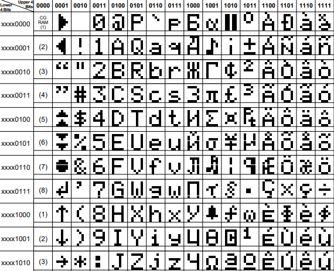

Vale ressaltar que todas as macros foram criadas com base nos dados obtidos do datasheet, cujo o link se encontra no tópico de bibliografia.

<h2>MAIN</h2>

O arquivo "main.s" é responsável por conectar todos os módulos do sistema e apresentar a interface para o usuário. As principais funcionalidades incluem a escolha e exibição do estado de diferentes sensores, comunicação UART para obter dados específicos, manipulação de contadores e tratamento de exceções.

Ele começa com diretivas de inclusão que trazem implementações específicas de funções (GPIO, sleep, LCD, UART, CCU) e macros. Em seguida, há uma rotina de inicialização marcada por _start. Esta rotina configura a memória, define pinos GPIO como entradas e saídas, inicia o LCD e prepara variáveis para controlar o estado do programa.

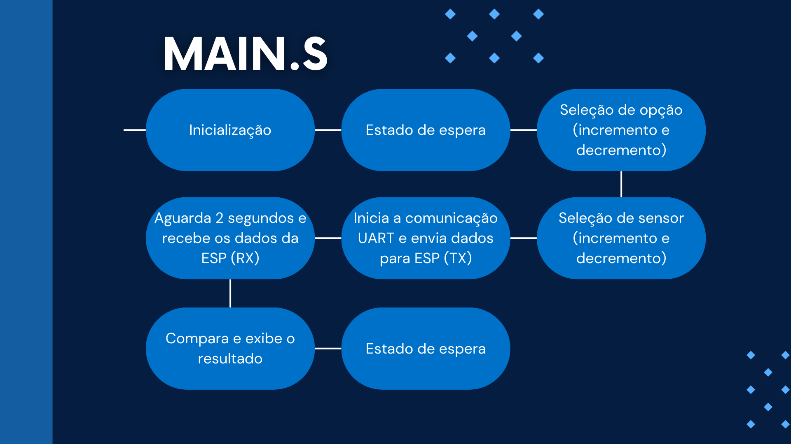

- Loop Principal (_start):

   - Inicializa registradores (R6, R9, R13) e chama a sub-rotina carrega_situacao.

- O programa então entra na branch espera, aguardando a interação do usuário por meio de três botões (b1, b2, b3). Dependendo do botão pressionado, diferentes ações são realizadas.

   - selecionar_opcao: configura uma opção específica (indicada por R12) e chama a função escolher_sensor.
   - incrementa: incrementa o contador (indicada por R13) e desvia para a opção de exibição de acordo com o valor do contador (que vai de 0 a 4).
   - decrementa: decrementa o contador (indicada por R13) e desvia para a opção de exibição de acordo com o valor do contador (que vai de 0 a 4).

- Seleção do sensor (escolher_sensor):

Depois de selecionado a opção de requisição através de selecionar_opcao e espera de liberação do botão b2, a camada de seleção do sensor é ativada. Nessa branch também é utilizado os botões (b1, b2, b3) para fazer variação do sensor (1 a 32) através do contador (indicado por R12) e seleção do sensor escolhido, ativando a uart.

   - ativar_uart: inicializa a comunicação UART, aguarda a reposta e a processa e atualiza o display com o resultado.
   - incrementa_sensor: incrementa o contador (indicada por R12) e desvia para a opção de exibição de acordo com o valor do contador (que vai de 1 a 32).
   - decrementa_sensor: decrementa o contador (indicada por R12) e desvia para a opção de exibição de acordo com o valor do contador (que vai de 1 a 32).

- Intermediário (intermediario):

   - Aguarda a liberação do botão b2.
   - Retorna para a espera se b1 ou b3 for pressionado.

- Incremento (incrementa):

   - Aguarda a liberação do botão b3.
   - Incrementa o índice R13.
   - Limpa o display e executa a função associada ao índice.

- Decremento (decrementa):

   - Aguarda a liberação do botão b1.
   - Decrementa o índice R13.
   - Limpa o display e executa a função associada ao índice.

- Incremento do Sensor (incrementa_sensor):

   - Aguarda a liberação do botão b3.
   - Incrementa o índice R12 (sensor).
   - Escreve o sensor no display e volta para a escolha do sensor.

- Decremento do Sensor (decrementa_sensor):

   - Aguarda a liberação do botão b1.
   - Decrementa o índice R12 (sensor).
   - Escreve o sensor no display e volta para a escolha do sensor.

- Escrever Sensor (escrever_sensor):

   - Captura os dígitos do sensor.
   - Escreve o sensor no display e retorna à escolha do sensor.

- Tratamento de Exceções (sensor_com_problema, sensor_inexistente, requisicao_inexistente, sensor_funcionando):

   - Limpa o display.
   - Carrega a mensagem correspondente.
   - Exibe a mensagem no display.

- Saída (EXIT):

   - Encerra a execução do programa.

Por fim, a última seção do código contém definições de rótulos que representam endereços de registradores relacionados a diversos aspectos do hardware da Orange Pi PC Plus, além de constantes de tempo usadas para atrasar o fluxo de execução e strings usadas para exibir os caracteres no display LCD.

<h1 id="descricao-e-analise-dos-testes" align="center">Descrição e Análise dos Testes e Simulações, Resultados e Discussões</h1>

Na etapa final do projeto proposto, obteve-se excelentes resultados conforme as especificações desejadas, o sistema realiza a leitura e entrega precisa dos dados solicitados e a interface desenvolvida cumpre diretamente com seu papel interativo e ilustrativo, assim proporcionando uma melhor tomada de decisão por parte do usuário que a opera. Contudo, destaca-se um problema durante a ativação do sensoriamento contínuo. O mesmo é acionado e exibe o primeiro resultado. Depois, a UART não é resetada, o que impede do valor que está sendo recebido pela ESP de ser atualizado na FIFO. O sensoriamento contínuo também não é finalizado. Portanto, qualquer outra requisição que for feita depois da solicitação do contínuo não irá funcionar corretamente, pois o valor que ainda vai estar sendo recebido é o do sensoriamento contínuo.

No que diz respeito à operação do programa e à interação direta com o usuário. Após enviar o código para a placa, a interação do usuário ocorre inteiramente através de três botões presentes na placa e as opções aparecem individualmente na tela LCD. Os botões laterais permitem ao usuário percorrer entre as opções de uma mesma camada. O botão central permite a seleção da opção que o usuário deseja.

Dessa forma, tem-se o seguinte fluxo, onde o usuário primeiro escolhe uma opção dentre as cinco possíveis (Situação Atual do Sensor, Temperatura Atual, Umidade Atual, Monitoramento Contínuo de Temperatura e Monitoramento Contínuo de Umidade) e depois escolhe um sensor, dentre os 32 suportados pelo sistema. O resultado aparecerá na linha de baixo do display. Para retornar à tela inicial, pressiona-se o botão do meio. 

Para garantir a funcionalidade da interface do display LCD, foram produzidos os seguintes testes essenciais para verificar a integridade da interface desenvolvida e a entrega precisa dos dados lidos pelo sensor:

Verificação da opção de funcionamento do sensor;
Verificação da opção de temperatura atual;
Verificação da opção de umidade atual;
Verificação da opção de temperatura contínua;
Verificação da opção de umidade contínua;

O sensor DHT11 na ESP estava pinado no endereço 0x0F, portanto os testes acima foram realizados em um endereço de sensor não conectado (inexistente) e no endereço 0x0F. Por fim, foi efetuado o teste de desconexão do sensor DHT11 do endereço 0x0F apresentado em [vídeo](https://youtu.be/PTe_jFINdzw?si=wj42PmV2BfBhX9Pb).

Segue abaixo os resultados desses testes.

Verificação do Funcionamento do Sensor

Um dos testes iniciais foi direcionado para assegurar o funcionamento correto do sensor selecionado e a resposta do sistema quando solicitamos essa opção. Para isso, primeiro selecionamos a opção de “Situacao Sensor” (tela inicial) com o botão do meio, em seguida usamos o botão lateral para avançarmos até o sensor 15 (sensor funcionando) e pressionamos mais uma vez o botão central.

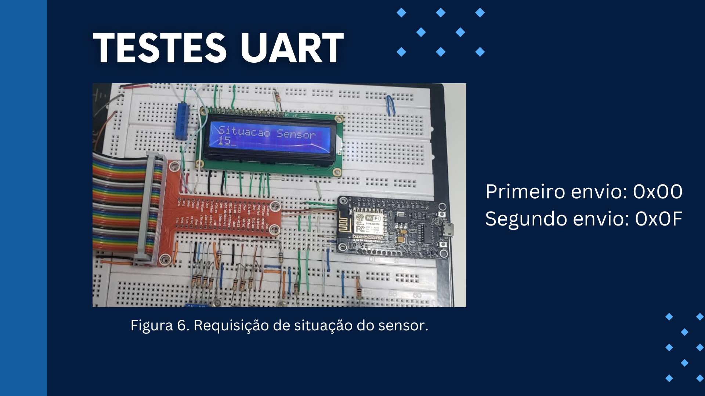

Resultado: Os resultados deste teste indicaram que o sensor estava operando conforme o esperado e, portanto, a resposta que aparece no display é "Sen. funcionando".

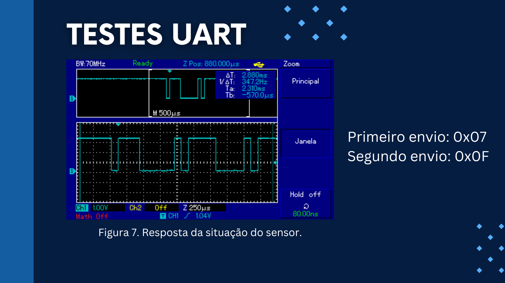
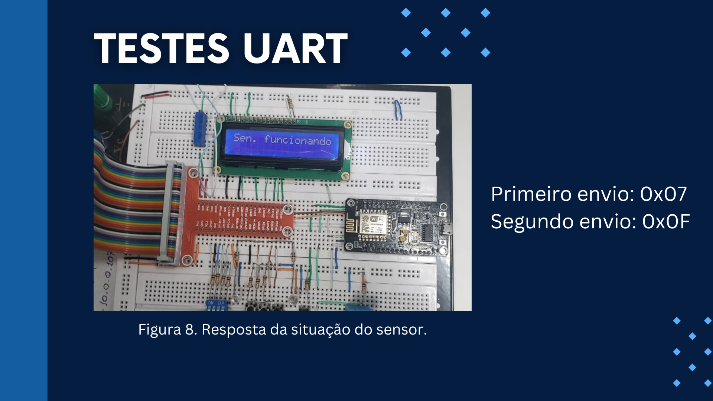

Em seguida, testou-se a condição de selecionar um sensor que não estava ligado ao sistema. Nesse caso, o sensor selecionado foi o sensor 1.

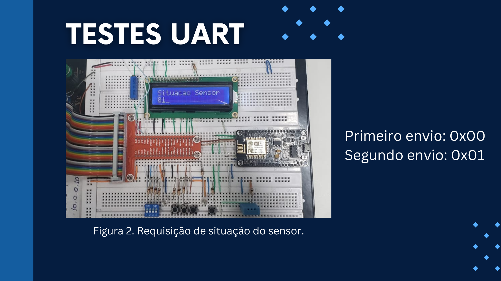

Resultado: Os resultados deste teste indicaram que o sensor não estava operando. Assim, a resposta que aparece no display é "Sen. inexistente".

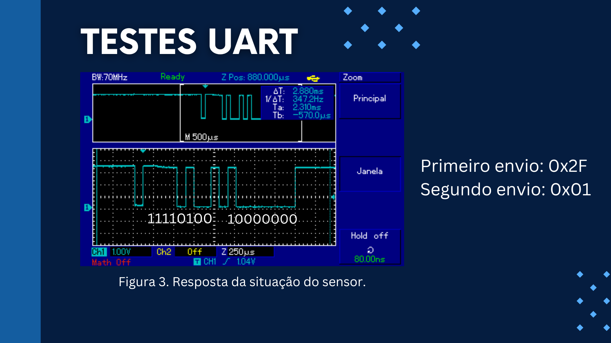

Exigência da Temperatura Atual e Umidade Atual

Outro conjunto de testes foi realizado para solicitar a leitura instantânea da temperatura e umidade atual do ambiente. Esses testes tinham como objetivo verificar a precisão e a prontidão com que a interface apresenta essas informações.

O primeiro teste foi com relação a temperatura atual. Primeiro, utiliza-se os botões laterais para selecionar a função de “Temperatura A.”. Em seguida, seleciona-se novamente o sensor que estava operando (sensor 15). 

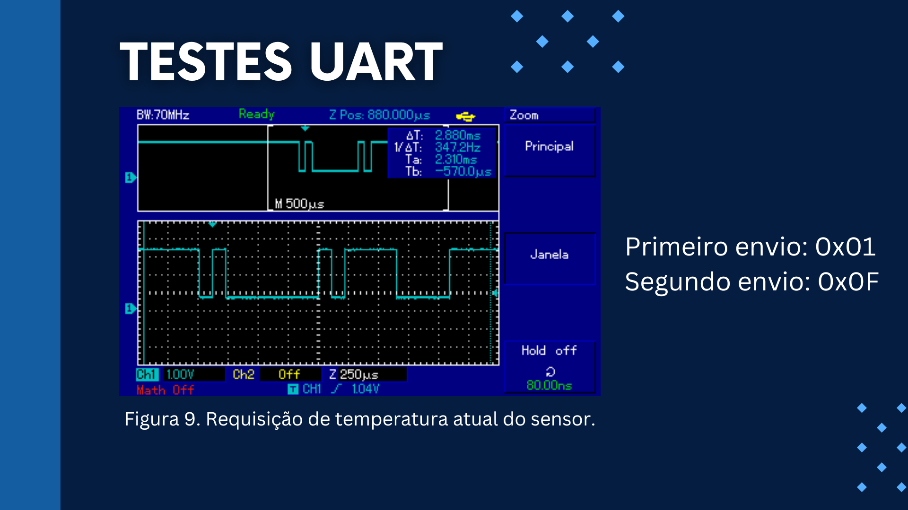
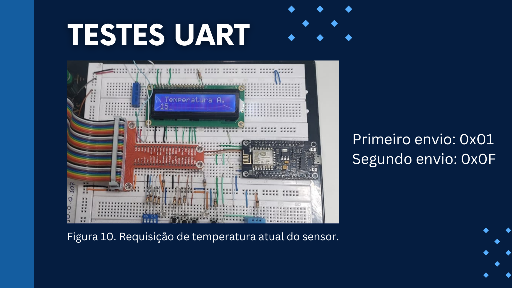

Resultado: A interface foi capaz de requisitar e exibir com sucesso os valores de temperatura atual provenientes do sensor. Nesse caso, a temperatura ambiente era de  aproximadamente 20 °C, assim como indicado na tela do display.

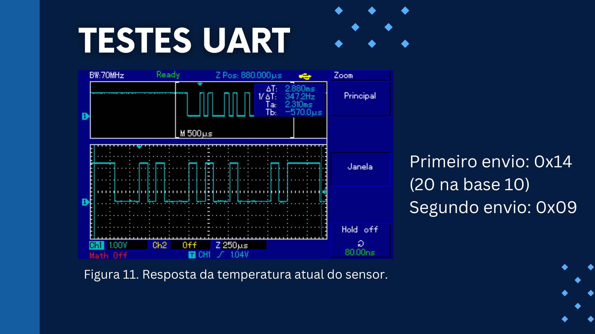
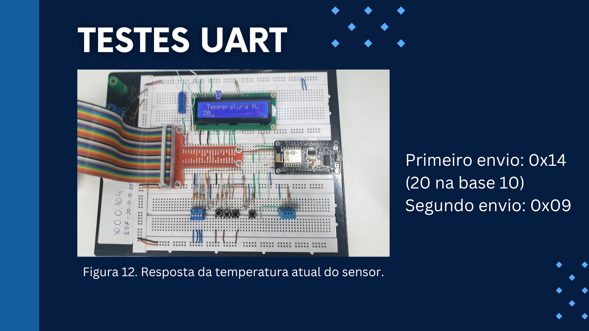

O segundo teste desta seção foi com o requerimento da umidade atual. O procedimento é parecido, mas nesse caso, seleciona-se a opção de "Umidade Atual " na primeira camada e em seguida o mesmo sensor 15.

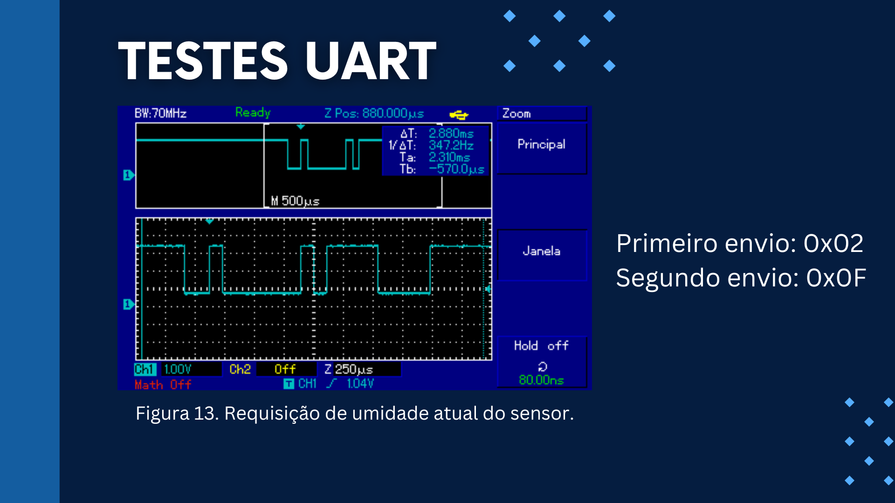
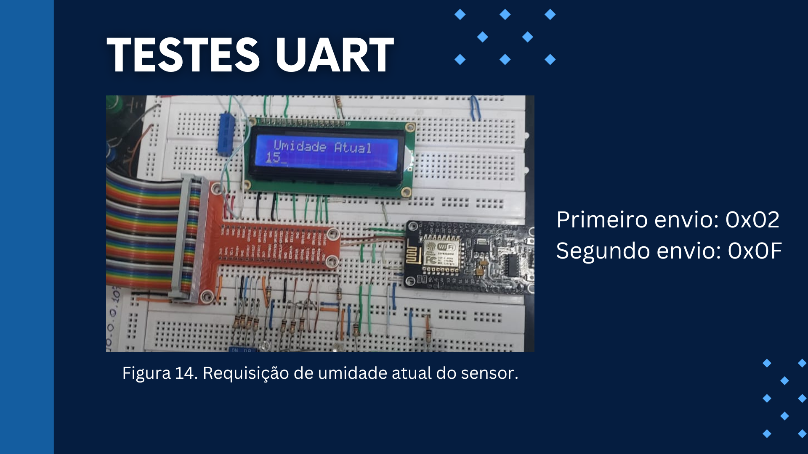

Resultado: O sistema faz a leitura correta da umidade atual e exibe no display de forma adequada. Nesse caso, a umidade ambiente era de aproximadamente 40%.

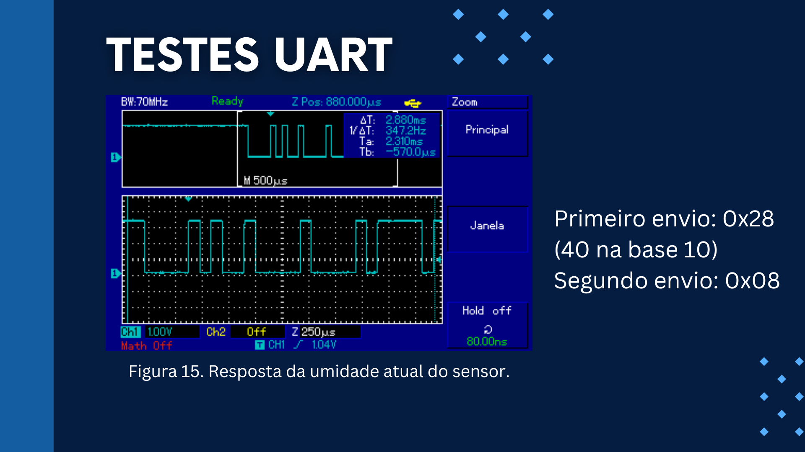
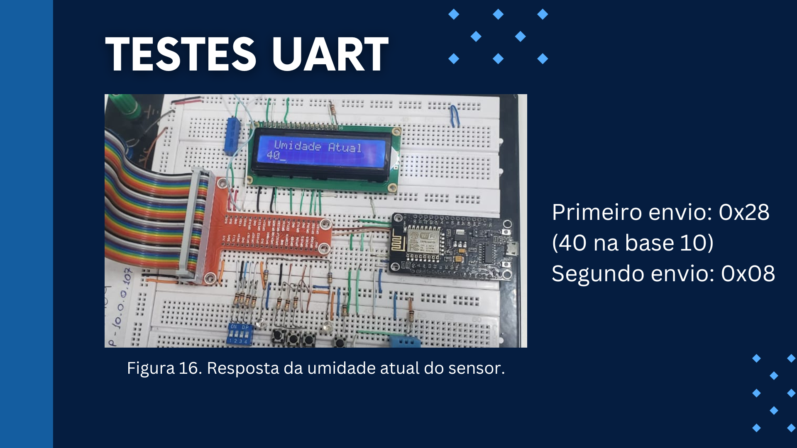

Exigência de Temperatura Contínua e Umidade Contínua

Além das leituras pontuais, foram conduzidos testes para exigir uma transmissão contínua de dados de temperatura e umidade. Este teste foi elaborado para avaliar a capacidade da interface em receber e exibir dados constantes ao longo do tempo.

O primeiro teste para o monitoramento contínuo foi com relação a temperatura. Para isso, selecionou-se a opção de " Temperatura C. " através dos botões. Em seguida selecionou o sensor 15, que estava conectado ao sistema e funcionando. 

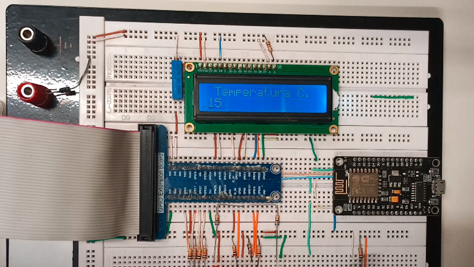

Resultado: O valor exibido no display LCD foi de 19° C. Entretanto, os testes de transmissão contínua de temperatura não forneceram os resultados esperados, pois o sensoriamento contínuo não é encerrado após o retorno para a branch de espera. 

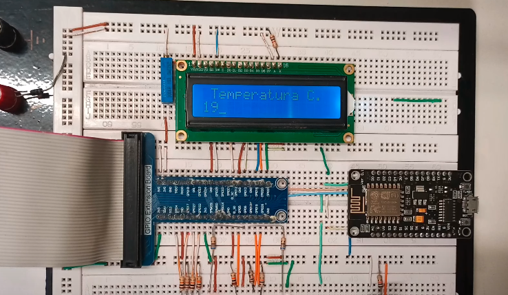

Em seguida testou-se a leitura para umidade contínua, selecionando a opção de "Umidade Contínua" e o sensor 15, novamente.

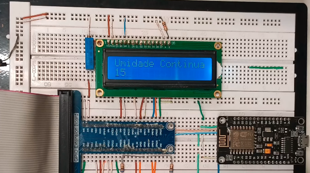

Resultado: O valor exibido no display LCD continuou sendo de 19° C, mostrando que o sensoriamento não foi interrompido. Portanto, o teste de transmissão contínua de umidade também não alcançou os resultados esperados, pois os dados apresentados ainda eram da temperatura contínua. Quando testada individualmente, apresentou a mesma característica da temperatura contínua.

A falha na transmissão contínua dos dados de temperatura e umidade revela uma limitação na implementação da interface em Assembly para o SBC Orange Pi. Esta limitação pode ser atribuída a possíveis desafios na manipulação contínua dos dados provenientes do sensor, levando a interrupções ou problemas na exibição contínua das informações. De acordo com as tentativas feitas pela equipe, quando associava o sensoriamento contínuo com a exibição no display, erros de segmentação de memória eram apresentados. Isso nos permite avaliar que os possíveis problemas estão na alocação de memória inválida e/ou no uso incorreto de registradores.

A dificuldade em atender completamente aos requisitos de transmissão contínua destaca a complexidade da programação em Assembly para a IHM, particularmente quando se trata de manter uma exibição contínua de dados dinâmicos.

Testes feitos em vídeo disponível em:

<h1 id="conclusao" align="center">Conclusão</h1>

Durante a evolução deste projeto, alcançamos com êxito a maioria dos objetivos estabelecidos, culminando na implementação bem-sucedida de uma Interface Homem-Máquina (IHM) em Assembly para o display LCD, substituindo a versão anterior feita em linguagem C. Este resultado não apenas representa a adaptação da lógica de um programa anteriormente desenvolvido em uma linguagem de alto nível para uma linguagem de baixo nível, mas também reflete a aplicação eficaz dos conceitos de arquitetura de computadores transmitidos ao longo do curso pelos docentes.

Ademais, o domínio da programação em Assembly para a Orange Pi All Winner, aliado à análise minuciosa da arquitetura e seus recursos, assim como a compreensão do mapeamento de memória e do funcionamento do display, permitiu não apenas a transição da lógica do software, mas também uma avaliação criteriosa do desempenho do código gerado. A experiência de codificar em Assembly proporcionou um entendimento mais profundo do funcionamento interno dos dispositivos, capacitando-nos a moldar o comportamento do sistema de acordo com nossos requisitos específicos.

Com a implementação da comunicação UART e a utilização de uma ESP com DHT11, conseguimos criar uma interação eficiente entre diferentes dispositivos, promovendo a coleta e transmissão de dados entre eles. Este é um testemunho do poder e flexibilidade da linguagem Assembly quando aplicada à manipulação direta do hardware.

Ao configurar o LCD Hitachi e orquestrar todo o processo de execução, desde a coleta de dados do sensor até a exibição da situação atual, temperatura e umidade, alcançamos um controle preciso sobre o sistema. No entanto, é importante reconhecer que alguns desafios persistem, como a implementação contínua da leitura de temperatura e umidade.

Por fim, acredita-se que esse projeto evidenciou de forma clara a relevância da linguagem Assembly em contextos que exigem recursos limitados de hardware, como é o caso do SBC Orange Pi. Através da experiência adquirida ao desenvolver a IHM em Assembly, fortalecemos os conhecimentos teóricos sobre arquitetura de computadores e ampliamos nossa habilidade para solucionar desafios práticos relacionados à programação de baixo nível.

<h1 id="bibliografia" align="center">Bibliografia</h1>

- Datasheet display LCD: https://www.sparkfun.com/datasheets/LCD/HD44780.pdf, acessado em 12 de 2023;
  
- Datasheet Allwinner H3: https://linux-sunxi.org/images/4/4b/Allwinner_H3_Datasheet_V1.2.pdf, acessado em 12 de 2023.

- Os repositórios do github [AssemblyTimer](https://github.com/AssemblyTimer/TimerAssembly) e [Timer](https://github.com/traozin/Timer/blob/main/display.s) também foram utilizados como referência para o desenvolvimento dos módulos de GPIO e LCD.

<h1 id="script-de-compilacao" align="center">Uso do projeto</h1> 

1. **Compilação:**
   - Certifique-se de ter um ambiente de desenvolvimento Assembly configurado para a Orange Pi.
   - Compile o projeto usando o assembler adequado para a sua plataforma.

2. **Carregamento na Orange Pi:**
   - Carregue o binário gerado na Orange Pi.

3. **Execução:**
   - Execute o programa principal (`main.s`) na Orange Pi.

4. **Interaja com o Sistema:**
   - Utilize os botões ou dispositivos de entrada conectados para interagir com a interface do usuário no Display LCD.

### Observações Importantes

- **Configuração dos Pinos:**
   - Verifique se a configuração dos pinos GPIO e outras interfaces (UART, LCD) está correta para a sua Orange Pi específica.

- **Documentação:**
   - Consulte a documentação específica da Orange Pi para obter detalhes sobre registradores, pinouts e outros aspectos do hardware.

